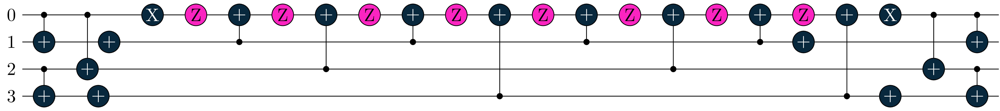
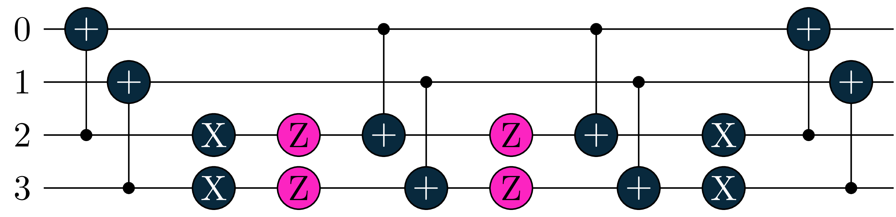

# UCC (unitary coupled-cluster) Inspired Circuit Environment

## How to use in the current code
copy the file `ucc_environment.py` into `main.py` and replace
```python
from environment import CircuitEnv
```
with 
```python
from ucc_environment import CircuitEnvUCC as CircuitEnv
```
thats it.

## Changes compared to previous Env
Instead of starting from an empty circuit and building the circuit up from Rx,Ry,Rz and CNOT we start from the Hartree-Fock state (a fixed layer of X-gates) and add single and double qubit excitations.  
Basically we are building circuits like in Fig.1 of [arxiv:2207.12421](https://arxiv.org/abs/2207.12421) with R corresponding to single and C to double qubit excitations and instead of the U blocks in the beginning we start from the Hartree-Fock state.  

### Limitations
- Currently limited to Jordan-Wigner encoding of the molecule
- Some Approximations made (see below)
- Hartree-Fock state currently hard-coded to 2 electron systems when `n_electrons` variable is not set. Set it with:
```python
environment = CircuitEnv(..., n_electrons=...)
```

### Gates
We allow to different types of gates: single and double qubit excitations. For simplicity the single excitations always come in pairs (treating the corresponding spin-up and spin-down electrons on the same lever).  
When compiled into native gates, double excitations (exicting electrons from qubits 0,1 to 2,3 and vice versa) look like:  
  
  
  
so they have a depth of 22, while two single excitations (exciting an electron from qubit 0 to 2 and another from qubit 1 to 3) look like:  
  
  
  
with a depth of 8.

### Encoding
We use the same encoding and interpret it differently:  
Four integers [a,b,c,d]:
- [a,b] encodes double excitations between qubits 2a and 2b to qubits 2a+1 and 2b+1
- [c,d] encodes single excitations from qubit 2c to 2d and 2c+1 to 2d+1
- double excitations are preferred and initialized as soon as a!=b and a smaller as Nq
- otherwise single excitations are iniaitlized as long as c!=d and c smaller as Nq
- if conditions are not met, no gate is initialized (potential danger of accumulating trash sequences)

### Approximations
Instead of Fermionic single-electron excitations (keep track of antisymmetry) we use single-qubit excitations.  
For simplicity in the encoding we still force qubit excitations corresponding to spin-up and spin-down electron excitations from the same orbital to have the same angles.  
This is inconsistent (spin-symmetry) but shouldn't matter much for systems like LiH. For larger systems we should either allow individual angles or directly use fermionic excitations.  
  
Instead of allowing all possible double excitation of electrons we restirct ourselves to spin-paired electrons from the same spatial orbitals (this corresponds to a quasi-particle excitation of a so-called hard-core Boson - see IA of [arxiv:2105.03836](https://arxiv.org/abs/2105.03836) ). So there is no approximation in the gate itself but an approximation in the range of different gates that we allow to be constructed.  

Reason for these approximations right now: Easier to adapt to current encoding and consistent in circuit depth (standard fermionic excitations vary in gate depth depending on the qubits on which they act).
